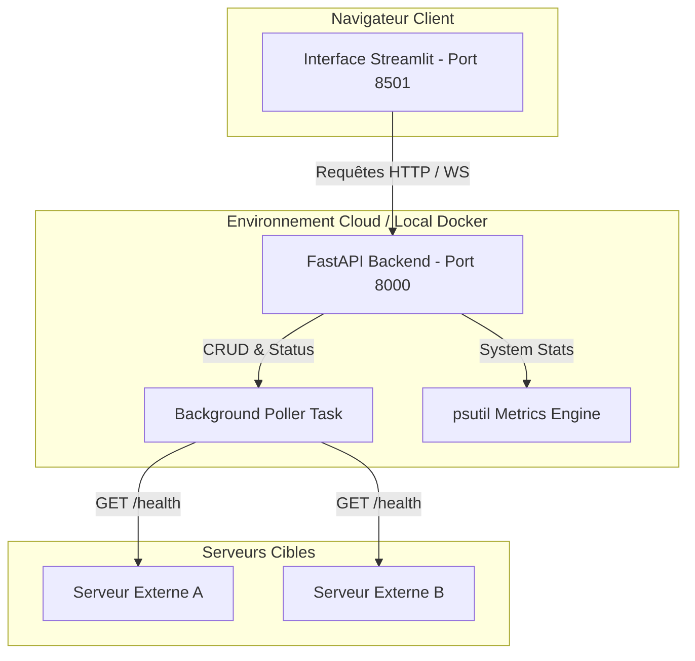

# 📊 DevOps Monitoring Dashboard

Système de monitoring en temps réel développé en Python. Il comprend une API REST/WebSocket (FastAPI) pour collecter les métriques système, un tableau de bord interactif (Streamlit) pour visualiser l'activité et gérer une flotte de serveurs, le tout containerisé avec Docker et automatisé via un pipeline CI/CD GitHub Actions vers Azure.

---

## 🏗️ Architecture du Projet



---

## ⚙️ Configuration & Variables d'Environnement

Le projet utilise les variables d'environnement définies dans un fichier `.env`. Pour configurer votre environnement, copiez le fichier de modèle :

```bash
cp .env.example .env
```

### Paramètres disponibles dans le `.env` :
*   `API_KEY` : Clé secrète requise pour enregistrer ou supprimer un serveur (par défaut : `demo-key`).
*   `API_BASE_URL` : URL de base utilisée par le Dashboard pour contacter l'API (par défaut : `http://api:8000` sous Docker, `http://localhost:8000` en local).
*   `PORT` : Port d'écoute pour l'API (par défaut : `8000`).

---

## 🚀 Lancement Rapide 

L'automatisation complète est gérée via le `Makefile`.

### Option A : Déploiement Local avec Docker Compose (Recommandé)

Lancez l'ensemble de l'architecture en une seule commande :
```bash
make up
```
*   **API FastAPI** : accessible sur [http://localhost:8000](http://localhost:8000)
    *   Documentation interactive Swagger : [http://localhost:8000/docs](http://localhost:8000/docs)
    *   Métriques brutes JSON : [http://localhost:8000/metrics](http://localhost:8000/metrics)
*   **Dashboard Streamlit** : accessible sur [http://localhost:8501](http://localhost:8501)

Pour arrêter les conteneurs et nettoyer les volumes :
```bash
make down
```

Pour consulter les logs en temps réel :
```bash
make logs
```

### Option B : Lancement Local en Mode Développement (Sans Docker)

1. Activez votre environnement virtuel Python 3.11.
2. Installez les dépendances requises :
   ```bash
   pip install -r requirements.txt
   ```
3. Exécutez le script d'automatisation :
   ```bash
   make dev
   ```

---

## 🧪 Qualité du Code & Tests

Le projet est configuré pour maintenir des standards de qualité élevés.

### 1. Analyse Statique (Linting)
Vérifiez la conformité du code avec les standards PEP 8 :
```bash
make lint
```

### 2. Tests Unitaires & Couverture
Exécutez la suite de tests unitaires et vérifiez que le taux de couverture dépasse les **75 %** requis :
```bash
make test
```

---

## 🛠️ Spécifications des Endpoints de l'API

L'API FastAPI expose les routes suivantes :

| Méthode | Endpoint | Authentification | Description |
| :--- | :--- | :---: | :--- |
| **GET** | `/health` | Non | Liveness probe pour Kubernetes/Azure App Service |
| **GET** | `/metrics` | Non | Récupère les métriques hôtes (CPU, RAM, Disque) via `psutil` |
| **WS** | `/ws/metrics` | Non | Stream JSON des métriques mis à jour toutes les secondes |
| **POST** | `/servers` | **Clé API** | Enregistre un nouveau serveur à surveiller |
| **GET** | `/servers` | Non | Liste les serveurs enregistrés (supporte le filtre `?status=UP`) |
| **GET** | `/servers/{id}`| Non | Récupère les détails d'un serveur spécifique |
| **DELETE**| `/servers/{id}`| **Clé API** | Supprime un serveur de la liste de monitoring |
| **POST** | `/servers/{id}/check` | Non | Déclenche un health check manuel immédiat |

> [!TIP]
> Pour tester les endpoints sécurisés, incluez le header `X-API-Key` avec la valeur configurée dans votre `.env` (ex: `X-API-Key: demo-key`).

---

## ☁️ Déploiement Continu sur Azure

Le pipeline CI/CD GitHub Actions (`.github/workflows/ci-cd.yml`) orchestre le déploiement sur chaque commit/push sur la branche `main`.

### Workflow du Pipeline (3 Jobs)
1.  **Test** : Exécute `make lint` (flake8) et `make test` (pytest avec couverture de code).
2.  **Build** : Si les tests passent, compile les images Docker de l'API et du Dashboard et les pousse sur Azure Container Registry (ACR).
3.  **Deploy** : Déploie et met à jour automatiquement les deux Azure Container Apps en utilisant `az containerapp update`.

### Configuration des Secrets GitHub
Pour connecter votre dépôt GitHub à votre abonnement Azure, configurez les secrets suivants dans les paramètres de votre dépôt GitHub (`Settings > Secrets and variables > Actions`) :

*   `AZURE_CLIENT_ID` : L'ID d'application (client ID) du service principal Azure.
*   `AZURE_CLIENT_SECRET` : Le mot de passe (secret client) du service principal.
*   `AZURE_TENANT_ID` : L'ID de locataire (tenant ID) de votre Azure AD.
*   `AZURE_SUBSCRIPTION_ID` : L'ID de votre abonnement Azure.
*   `ACR_NAME` : Le nom de votre registre Azure Container Registry (ex: `monregistryacr` si l'URL est `monregistryacr.azurecr.io`).
*   `API_KEY` : La clé d'accès sécurisée pour le backend.
